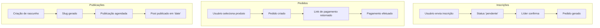

## Documentação de Coleções PocketBase

**Índice**

- [Template de Documentação de Coleção](#template-de-documentação-de-coleção)
- [Definição de Campos Comuns](#definição-de-campos-comuns)
- [Coleções Documentadas](#coleções-documentadas)
  - [1. produtos](#1-produtos)
  - [2. posts](#2-posts)
  - [3. pedidos](#3-pedidos)
  - [4. m24_clientes](#4-m24_clientes)
  - [5. inscricoes](#5-inscricoes)
  - [6. eventos](#6-eventos)
  - [7. clientes_pix](#7-clientes_pix)
  - [8. clientes_contas_bancarias](#8-clientes_contas_bancarias)
  - [9. clientes_config](#9-clientes_config)
  - [10. categorias](#10-categorias)
  - [11. campos](#11-campos)
  - [12. usuarios](#12-usuarios)
  - [13. manifesto_clientes](#13-manifesto_clientes)

---

## Diagramas de Fluxos



---

## Template de Documentação de Coleção

Para cada coleção, utilize a seguinte estrutura:

1. **Nome da coleção**
2. **Descrição resumida**
3. **Campos**
   | Campo | Tipo | Obrigatório | Descrição / Observações |
   | --------------- | ------- | ----------- | ----------------------- |
   | `campo_exemplo` | String | Sim | Ex.: CPF ou CNPJ, único |
   | `outro_campo` | Boolean | Não | Ex.: flag de ativação |
4. **Permissões / Roles**
   - Quem pode ler, criar, editar, deletar
   - Escopo multi-tenant (campo `cliente`)
5. **Relacionamentos**
   - Referências a outras coleções
   - Campo `expand` usado em queries
6. **Endpoints de API**
   - Rota interna (ex.: `/api/inscricoes`)
   - Métodos suportados (GET, POST, PATCH…)
   - Parâmetros de query ou body
7. **Fluxos de Negócios**
   - Quando/criar, em que momento é preenchida
   - Integração com Asaas, regras de confirmação
8. **Exemplo de payload**
   ```json
   {
     "campo_exemplo": "valor",
     "outro_campo": true
   }
   ```
9. **Notas adicionais**
   - **Índices**: Listar índices recomendados para melhorar performance das queries.
   - **Validações**: Definir regras de validação de campos (ex.: formatos, obrigatoriedade, limites).
   - **Webhooks**: Descrever triggers e webhooks críticos para cada evento (criação, atualização ou exclusão).

---

## Definição de Campos Comuns

| Campo     | Descrição                                   |
| --------- | ------------------------------------------- |
| `id`      | Identificador único gerado pelo PocketBase  |
| `created` | Timestamp de criação do registro            |
| `updated` | Timestamp da última atualização do registro |

---

## Coleções Documentadas

### 1. `produtos`

**Descrição**: armazena o catálogo de produtos disponíveis para venda ou distribuição em eventos, com configurações multi-tenant e controle de visibilidade por usuário e inscrição.

| Campo                       | Tipo                      | Obrigatório | Descrição / Observações                          |
| --------------------------- | ------------------------- | ----------- | ------------------------------------------------ |
| `id`                        | ID                        | Sim         | Identificador único gerado pelo PocketBase       |
| `nome`                      | String                    | Sim         | Nome do produto                                  |
| `user_org`                  | Relation → `usuarios`     | Sim         | Organizador ou dono do produto                   |
| `quantidade`                | Number                    | Sim         | Estoque disponível (unidades)                    |
| `preco`                     | Number                    | Sim         | Preço líquido (base)                             |
| `preco_bruto`               | Number                    | Sim         | Valor final ao cliente (Pix à vista)            |
| `ativo`                     | Boolean                   | Sim         | Se o produto está ativo/visível no front         |
| `tamanhos`                  | Array                     | Não         | Tamanhos disponíveis: `PP`, `P`, `M`, `G`, `GG`  |
| `imagens`                   | Array                     | Não         | Galeria de imagens                               |
| `descricao`                 | Text                      | Não         | Descrição breve para listagem                    |
| `detalhes`                  | Text                      | Não         | Descrição completa / especificações técnicas     |
| `categoria`                 | Relation → `categorias`   | Não         | Categoria(s) do produto                          |
| `slug`                      | String                    | Sim         | Slug URL-friendly (ex.: `camiseta-preta-basica`) |
| `cores`                     | Array                     | Não         | Lista de cores disponíveis (hex ou nome)         |
| `generos`                   | Array                     | Não         | Gêneros aplicáveis: `masculino`, `feminino`      |
| `cliente`                   | Relation → `m24_clientes` | Sim         | Tenant proprietário (multi-tenant)               |
| `exclusivo_user`            | Boolean                   | Não         | Só usuário específico pode ver/comprar           |
| `requer_inscricao_aprovada` | Boolean                   | Não         | Requer inscrição aprovada antes da compra        |
| `evento_id`                 | Relation → `eventos`      | Não         | Evento associado ao produto                      |
| `created`                   | DateTime                  | Sim         | Timestamp de criação                             |
| `updated`                   | DateTime                  | Sim         | Timestamp da última atualização                  |

**Permissões / Roles**

- Leitura: Usuário geral vê apenas produtos com `ativo = true` e, se `requer_inscricao_aprovada = true`, somente após inscrição aprovada. Organizador (`user_org`) e `admin` veem tudo.
- Gravação: `admin` e `user_org` podem criar / editar / deletar. Usuários comuns não têm acesso de escrita.

**Relacionamentos**

- `user_org` → `usuarios.id`
- `categoria` → `categorias.id`
- `cliente` → `m24_clientes.id`
- `evento_id` → `eventos.id`

**Endpoints de API**

| Rota                       | Métodos | Descrição                                                         |
| -------------------------- | ------- | ----------------------------------------------------------------- |
| `GET  /api/produtos`       | GET     | Lista produtos (suporta filtros por `ativo`, `categoria`, `slug`) |
| `GET  /api/produtos/:id`   | GET     | Detalha um produto                                                |
| `POST /api/produtos`       | POST    | Cria novo produto                                                 |
| `PATCH /api/produtos/:id`  | PATCH   | Atualiza campos de um produto                                     |
| `DELETE /api/produtos/:id` | DELETE  | Remove produto                                                    |

**Fluxos de Negócios**

1. Publicação: Ao criar, `ativo` pode vir como `false`. O front-end exibe botão “Publicar” que faz `PATCH ativo=true`.
2. Controle de Estoque: Em cada pedido, a API decrementa `quantidade`. Se chegar a zero, seta `ativo=false`.
3. Checkout Integrado: Se `requer_inscricao_aprovada=true`, bloqueia botão “Comprar” até webhook de aprovação de inscrição; caso contrário, gera link de pagamento Asaas via `/api/asaas/checkout`.

**Exemplo de Payload**

```json
{
  "nome": "Camiseta Básica Preta",
  "user_org": "abc123usuario",
  "quantidade": 50,
  "preco": 4990,
  "preco_bruto": 5350,
  "ativo": true,
  "tamanhos": ["P", "M", "G"],
  "slug": "camiseta-basica-preta",
  "cliente": "tenant_xyz",
  "requer_inscricao_aprovada": false
}
```

**Notas Adicionais**

- **Índices**: Índice sugerido em `slug` para buscas rápidas.
- **Validações**: `preco >= 0`, `quantidade >= 0`.
- **Webhooks**: Ao criar/atualizar `evento_id`, enviar mensagem ao canal de notificações; Ao `quantidade` < 10, notificar organizador.

---

### 2. `posts`

**Descrição**: armazena artigos do blog (news, anúncios, conteúdos institucionais) de cada tenant, com suporte a SEO e agendamento de publicação.

| Campo       | Tipo                      | Obrigatório | Descrição / Observações                                                                         |
| ----------- | ------------------------- | ----------- | ----------------------------------------------------------------------------------------------- |
| `id`        | ID                        | Sim         | Identificador único gerado pelo PocketBase                                                      |
| `title`     | String                    | Sim         | Título do post                                                                                  |
| `slug`      | String                    | Sim         | URL-friendly (ex.: `como-configurar-pocketbase-em-nextjs`); idealmente único                    |
| `summary`   | Text                      | Não         | Resumo ou excerpt para listagem                                                                 |
| `content`   | Text                      | Sim         | Conteúdo HTML/Markdown completo                                                                 |
| `category`  | Relation → `categorias`   | Não         | Categoria do post (ex.: `blog`, `news`, `docs`); se não preencher, fica em “Sem categoria”      |
| `thumbnail` | File                      | Não         | Imagem de capa                                                                                  |
| `keywords`  | Array                     | Não         | Tags/keywords para SEO (ex.: [`"nextjs"`, `"pocketbase"`, `"multi-tenant"`])                    |
| `cliente`   | Relation → `m24_clientes` | Sim         | Tenant proprietário (multi-tenant)                                                              |
| `date`      | Date                      | Sim         | Data de publicação (YYYY-MM-DD). Se futura, post fica “agendado”; se omitida, assume `created`. |
| `created`   | DateTime                  | Sim         | Timestamp de criação                                                                            |
| `updated`   | DateTime                  | Sim         | Timestamp da última atualização                                                                 |

**Permissões / Roles**

- Leitura: Público vê posts com `date ≤ hoje`; Admin/Autor acessam drafts e agendados.
- Gravação: `admin` e `editor` podem criar/editar/deletar.

**Relacionamentos**

- `category` → `categorias.id`
- `cliente` → `m24_clientes.id`

**Endpoints de API**

| Rota                    | Métodos | Descrição                                                           |
| ----------------------- | ------- | ------------------------------------------------------------------- |
| `GET  /api/posts`       | GET     | Lista posts (filtros por `category`, `slug`, `date_from`/`date_to`) |
| `GET  /api/posts/:id`   | GET     | Detalha um post                                                     |
| `POST /api/posts`       | POST    | Cria novo post                                                      |
| `PATCH /api/posts/:id`  | PATCH   | Atualiza campos de um post                                          |
| `DELETE /api/posts/:id` | DELETE  | Remove post                                                         |

**Fluxos de Negócios**

1. Rascunho → Publicação: Cria com `date` ≥ hoje → “Agendado”.
2. Slug Automático: Se `slug` vazio, é gerado a partir do `title`.
3. SEO & Open Graph: `keywords` para `<meta>` e `thumbnail` para `og:image`.

**Exemplo de Payload**

```json
{
  "title": "Como Integrar Next.js com PocketBase Multipart",
  "slug": "integrar-nextjs-pocketbase-multipart",
  "summary": "Passo a passo para enviar arquivos no PocketBase via Next.js API routes.",
  "content": "<h2>Introdução</h2><p>...</p>",
  "category": "cat123blog",
  "thumbnail": "file_abcd1234",
  "keywords": ["nextjs", "pocketbase", "api", "files"],
  "cliente": "tenant_xyz",
  "date": "2025-07-01"
}
```

**Notas Adicionais**

- **Índices**: `slug`, `date`.
- **Validações**: `title.length ≥ 5`, `date ≥ created`.
- **Webhooks**: build cache/CDN ao publicar; invalidar rota estática ao deletar.

---

### 3. `pedidos`

**Descrição**: armazena os pedidos de compra, integrando inscrições e loja, com controle de pagamento e gestão de itens.

| Campo            | Tipo                      | Obrigatório | Descrição / Observações                                       |
| ---------------- | ------------------------- | ----------- | ------------------------------------------------------------- |
| `id`             | ID                        | Sim         | Identificador único gerado pelo PocketBase                    |
| `id_pagamento`   | String                    | Sim         | Identificador retornado pelo gateway de pagamento             |
| `id_inscricao`   | Relation → `inscricoes`   | Não         | Referência à inscrição associada (quando `canal = inscricao`) |
| `tamanho`        | Enum                      | Não         | Tamanho do produto: `PP`, `P`, `M`, `G`, `GG`                 |
| `email`          | String                    | Sim         | Email de confirmação / contato                                |
| `status`         | Enum                      | Sim         | Status do pedido: `pendente`, `pago`, `vencido`, `cancelado`             |
| `campo`          | Relation → `campos`       | Não         | Referência a campos adicionais definidos na coleção `campos`  |
| `responsavel`    | Relation → `usuarios`     | Não         | Usuário responsável pela gestão do pedido                     |
| `genero`         | Enum                      | Não         | Gênero do destinatário: `masculino`, `feminino`               |
| `valor`          | Number                    | Sim         | Valor total do pedido (em centavos ou decimal)                |
| `link_pagamento` | String                    | Sim         | URL para pagamento (Asaas ou outro gateway)                   |
| `cliente`        | Relation → `m24_clientes` | Sim         | Tenant proprietário (multi-tenant)                            |
| `canal`          | Enum                      | Sim         | Origem do pedido: `inscricao`, `loja`                         |
| `produto`        | Relation[] → `produtos`   | Não         | Produtos incluídos no pedido                                  |
| `cor`            | String                    | Não         | Cor selecionada (hex ou nome)                                 |
| `created`        | DateTime                  | Sim         | Timestamp de criação                                          |
| `updated`        | DateTime                  | Sim         | Timestamp da última atualização                               |

**Permissões / Roles**

- Leitura: Usuário geral vê apenas pedidos próprios (`email` ou `responsavel`) e com `status != cancelado`; `admin` e `user_org` veem todos.
- Gravação: API interna e `admin` para criação automática (fluxo de inscrição); Usuário final pode criar (`POST`) e consultar seu próprio pedido.

**Relacionamentos**

- `id_inscricao` → `inscricoes.id`
- `responsavel` → `usuarios.id`
- `cliente` → `m24_clientes.id`
- `produto` → `produtos.id`

**Endpoints de API**

| Rota                      | Métodos | Descrição                                              |
| ------------------------- | ------- | ------------------------------------------------------ |
| `GET  /api/pedidos`       | GET     | Lista pedidos (filtros por `status`, `email`, `canal`) |
| `GET  /api/pedidos/:id`   | GET     | Detalha um pedido                                      |
| `POST /api/pedidos`       | POST    | Cria novo pedido (fluxo de loja ou inscrição)          |
| `PATCH /api/pedidos/:id`  | PATCH   | Atualiza status ou outros campos do pedido             |
| `DELETE /api/pedidos/:id` | DELETE  | Cancela pedido                                         |

**Fluxos de Negócios**

1. Loja: Usuário seleciona produtos no front e faz `POST /api/pedidos` → retorno de `link_pagamento`. Webhook de pagamento atualiza `status` para `pago` → decrementa estoque (`produtos.quantidade`).
2. Inscrição: Após aprovação de inscrição, sistema cria pedido automaticamente com `canal = inscricao` e `id_inscricao`. Usuário recebe `link_pagamento` por email.
3. Cancelamento: `PATCH /api/pedidos/:id` com `status = cancelado` → libera estoque e notifica responsável.

**Exemplo de Payload**

```json
{
  "id_inscricao": "insc_abc123",
  "email": "user@example.com",
  "tamanho": "M",
  "status": "pendente",
  "valor": 5990,
  "link_pagamento": "https://asaas.com/pay/xyz",
  "cliente": "tenant_xyz",
  "canal": "loja",
  "produto": ["prod_123", "prod_456"]
}
```

**Notas Adicionais**

- **Índices**: considere índices em `id_pagamento` e `email`.
- **Validações**: `valor > 0`; `status` deve ser um dos valores permitidos.
- **Webhooks**: Ao `status = pago`, acionar ajuste de estoque e envio de e-mail de confirmação; Ao `status = cancelado`, acionar reversão de estoque e notificação de reembolso.

---

### 4. `m24_clientes`

**Descrição**: armazena os tenants (clientes) com suas configurações, informações fiscais, domínio e integração com Asaas.

| Campo               | Tipo                  | Obrigatório | Descrição / Observações                                          |
| ------------------- | --------------------- | ----------- | ---------------------------------------------------------------- |
| `id`                | ID                    | Sim         | Identificador único gerado pelo PocketBase                       |
| `nome`              | String                | Sim         | Nome ou razão social do cliente                                  |
| `dominio`           | String                | Sim         | Domínio ou subdomínio configurado para o tenant                  |
| `responsavel_email` | String                | Não         | Email do responsável pelo tenant                                 |
| `ativo`             | Boolean               | Sim         | Define se o tenant está ativo                                    |
| `documento`         | String                | Sim         | CPF ou CNPJ do cliente                                           |
| `asaas_account_id`  | String                | Sim         | ID da conta no Asaas                                             |
| `asaas_api_key`     | String                | Sim         | Chave API da subconta Asaas                                      |
| `verificado`        | Boolean               | Não         | Indica se o tenant foi verificado (domínio, dados fiscais, etc.) |
| `tipo_dominio`      | Enum                  | Não         | Tipo de domínio: `subdominio` ou `proprio`                       |
| `modo_validacao`    | Enum                  | Não         | Modo de validação do domínio: `manual` ou `wildcard`             |
| `usuario`           | Relation → `usuarios` | Sim         | Usuário responsável (owner) do tenant                            |
| `created`           | DateTime              | Sim         | Timestamp de criação                                             |
| `updated`           | DateTime              | Sim         | Timestamp da última atualização                                  |

**Permissões / Roles**

- Leitura: `admin` e sistema interno.
- Gravação: apenas `admin`.

**Relacionamentos**

- `usuario` → `usuarios.id`

**Endpoints de API**

| Rota                      | Métodos | Descrição        |
| ------------------------- | ------- | ---------------- |
| `GET /api/tenants`        | GET     | Lista tenants    |
| `GET /api/tenants/:id`    | GET     | Detalha tenant   |
| `POST /api/tenants`       | POST    | Cria novo tenant |
| `PATCH /api/tenants/:id`  | PATCH   | Atualiza tenant  |
| `DELETE /api/tenants/:id` | DELETE  | Remove tenant    |

**Fluxos de Negócios**

1. Criação de Tenant: configurar subconta Asaas e registrar domínio.
2. Validação de Domínio: `wildcard` via DNS ou `manual` via painel.
3. Verificação: após confirmação de domínio e dados fiscais, seta `verificado = true`.

**Exemplo de Payload**

```json
{
  "nome": "Empresa XYZ LTDA",
  "dominio": "app.empresaxyz.com",
  "responsavel_email": "contato@empresaxyz.com",
  "ativo": true,
  "documento": "12.345.678/0001-99",
  "asaas_account_id": "acc_abc123",
  "asaas_api_key": "key_xyz987",
  "verificado": false,
  "tipo_dominio": "proprio",
  "modo_validacao": "manual",
  "usuario": "user_abc123"
}
```

**Notas Adicionais**

- Índices únicos em `dominio` e `documento`.

---

### 5. `inscricoes`

**Descrição**: armazena solicitações de participação em eventos, com dados de contato, status de inscrição, pagamento e aprovação de líderes.

| Campo                  | Tipo                      | Obrigatório | Descrição / Observações                                       |
| ---------------------- | ------------------------- | ----------- | ------------------------------------------------------------- |
| `id`                   | ID                        | Sim         | Identificador único gerado pelo PocketBase                    |
| `nome`                 | String                    | Sim         | Nome do participante                                          |
| `email`                | String                    | Sim         | Email de contato                                              |
| `telefone`             | String                    | Sim         | Telefone de contato                                           |
| `cpf`                  | String                    | Sim         | CPF do participante (único)                                   |
| `campo`                | Relation → `campos`       | Não         | Campo vinculado (coordenadoria/região)                        |
| `criado_por`           | Relation → `usuarios`     | Não         | Usuário que criou a inscrição                                 |
| `status`               | Enum                      | Sim         | `pendente`, `confirmado`, `cancelado`, `aguardando_pagamento` |
| `pedido`               | Relation → `pedidos`      | Não         | Pedido gerado após confirmação                                |
| `genero`               | Enum                      | Não         | `feminino`, `masculino`                                       |
| `tamanho`              | Enum                      | Não         | `PP`, `P`, `M`, `G`, `GG`                                     |
| `evento`               | Relation → `eventos`      | Não         | Evento associado                                              |
| `paymentMethod`        | Enum                      | Não         | `pix`, `boleto`                                               |
| `data_nascimento`      | Date                      | Não         | Data de nascimento do participante                            |
| `confirmado_por_lider` | Boolean                   | Sim         | Marca aprovação feita pelo líder                              |
| `cliente`              | Relation → `m24_clientes` | Não         | Tenant proprietário (multi-tenant)                            |
| `produto`              | Relation[] → `produtos`   | Não         | Produtos vinculados à inscrição                               |
| `aprovada`             | Boolean                   | Não         | Indicador de aprovação final                                  |
| `created`              | DateTime                  | Sim         | Timestamp de criação                                          |
| `updated`              | DateTime                  | Sim         | Timestamp da última atualização                               |

**Permissões / Roles**

- Leitura: Usuário geral vê apenas próprias inscrições (`email` ou `criado_por`); `admin` e `user_org` veem todas.
- Gravação: Usuário cria inscrição; sistema interno e `admin` atualizam status e geram pedidos.
- O status `confirmado` só pode ser definido manualmente por um `coordenador` ou automaticamente via API/automação.

**Relacionamentos**

- `campo` → `campos.id`
- `criado_por` → `usuarios.id`
- `pedido` → `pedidos.id`
- `evento` → `eventos.id`
- `cliente` → `m24_clientes.id`
- `produto` → `produtos.id`

**Endpoints de API**

| Rota                         | Métodos | Descrição                                                  |
| ---------------------------- | ------- | ---------------------------------------------------------- |
| `GET /api/inscricoes`        | GET     | Lista inscrições (filtros por `status`, `evento`, `email`) |
| `GET /api/inscricoes/:id`    | GET     | Detalha uma inscrição                                      |
| `POST /api/inscricoes`       | POST    | Cria nova inscrição                                        |
| `PATCH /api/inscricoes/:id`  | PATCH   | Atualiza status, aprovação ou outros campos                |
| `DELETE /api/inscricoes/:id` | DELETE  | Cancela inscrição                                          |

**Fluxos de Negócios**

1. Criação → `status = pendente`.
2. Geração de cobrança Asaas → `status = aguardando_pagamento`.
3. Aprovação por líder → `status = confirmado`, `pedido` gerado.
4. Cancelamento → `status = cancelado`, liberação de vaga.

**Notas Adicionais**

- **Índices**: único em `cpf`.
- **Validações**: formatos de dados e valores obrigatórios.
- **Webhooks**: cobrança, aprovação e cancelamento.

---

### 6. `eventos`

**Descrição**: armazena os eventos criados pelos tenants, incluindo dados de título, descrição, data, localização, imagem e relação com produtos e inscrição.

| Campo             | Tipo                      | Obrigatório | Descrição / Observações                    |
| ----------------- | ------------------------- | ----------- | ------------------------------------------ |
| `id`              | ID                        | Sim         | Identificador único gerado pelo PocketBase |
| `titulo`          | String                    | Sim         | Título do evento                           |
| `descricao`       | Text                      | Não         | Descrição detalhada do evento              |
| `data`            | DateTime                  | Sim         | Data e hora do evento                      |
| `cidade`          | String                    | Não         | Cidade onde ocorrerá o evento              |
| `imagem`          | File                      | Não         | Imagem de capa ou banner do evento         |
| `status`          | Enum                      | Sim         | Estado do evento: `realizado`, `em breve`  |
| `cliente`         | Relation → `m24_clientes` | Sim         | Tenant proprietário (multi-tenant)         |
| `produtos`        | Relation[] → `produtos`   | Não         | Produtos associados ao evento              |
| `cobra_inscricao` | Boolean                   | Não         | Indica se o evento cobra inscrição         |
| `created`         | DateTime                  | Sim         | Timestamp de criação                       |
| `updated`         | DateTime                  | Sim         | Timestamp da última atualização            |

**Permissões / Roles**

- Leitura: Público vê eventos futuros e históricos; `admin` e `user_org` veem rascunhos.
- Gravação: `admin` e `user_org` podem criar/editar/deletar.

**Relacionamentos**

- `cliente` → `m24_clientes.id`
- `produtos` → `produtos.id`

**Endpoints de API**

| Rota                      | Métodos | Descrição                                    |
| ------------------------- | ------- | -------------------------------------------- |
| `GET /api/eventos`        | GET     | Lista eventos (filtros por `status`, `data`) |
| `GET /api/eventos/:id`    | GET     | Detalha um evento                            |
| `POST /api/eventos`       | POST    | Cria novo evento                             |
| `PATCH /api/eventos/:id`  | PATCH   | Atualiza evento                              |
| `DELETE /api/eventos/:id` | DELETE  | Remove evento                                |

**Fluxos de Negócios**

1. Agendamento → `status = em breve`.
2. Atualização de `status` para `realizado` após data.
3. Integração com inscrições se `cobra_inscricao = true`.

**Notas Adicionais**

- **Índices**: índice em `data`.
- **Validações**: `data` ≥ `created`.
- **Webhooks**: notificações de evento.

---

### 7. `clientes_pix`

**Descrição**: armazena as chaves Pix configuradas por tenant, com tipos, descrições, agendamento de ativação e relação com clientes.

| Campo               | Tipo                      | Obrigatório | Descrição / Observações                      |
| ------------------- | ------------------------- | ----------- | -------------------------------------------- |
| `id`                | ID                        | Sim         | Identificador único                          |
| `pixAddressKey`     | String                    | Sim         | Valor da chave Pix                           |
| `pixAddressKeyType` | Enum                      | Sim         | Tipo: `email`, `cpf`, `phone`, `evp`, `cnpj` |
| `description`       | String                    | Não         | Descrição do uso da chave Pix                |
| `scheduleDate`      | DateTime                  | Não         | Data agendada para ativação                  |
| `cliente`           | Relation → `m24_clientes` | Sim         | Tenant proprietário                          |
| `created`           | DateTime                  | Sim         | Timestamp de criação                         |
| `updated`           | DateTime                  | Sim         | Timestamp da última atualização              |

**Permissões / Roles**

- Leitura: `admin`, sistema interno e tenant veem suas chaves.
- Gravação: `admin` e `user_org`.

**Relacionamentos**

- `cliente` → `m24_clientes.id`

**Endpoints de API**

| Rota                           | Métodos | Descrição          |
| ------------------------------ | ------- | ------------------ |
| `GET /api/clientes_pix`        | GET     | Lista chaves Pix   |
| `GET /api/clientes_pix/:id`    | GET     | Detalha chave Pix  |
| `POST /api/clientes_pix`       | POST    | Cria chave Pix     |
| `PATCH /api/clientes_pix/:id`  | PATCH   | Atualiza chave Pix |
| `DELETE /api/clientes_pix/:id` | DELETE  | Remove chave Pix   |

**Fluxos de Negócios**

1. Agendamento → ativa após `scheduleDate`.
2. Sincronização com gateway Pix.

**Notas Adicionais**

- **Índices**: `pixAddressKey`.

---

### 8. `clientes_contas_bancarias`

**Descrição**: armazena contas bancárias dos tenants, com informações de titularidade, agência, conta e tipo.

| Campo             | Tipo                      | Obrigatório | Descrição                                           |
| ----------------- | ------------------------- | ----------- | --------------------------------------------------- |
| `id`              | ID                        | Sim         | Identificador único                                 |
| `ownerName`       | String                    | Sim         | Nome do titular                                     |
| `cpfCnpj`         | String                    | Sim         | CPF/CNPJ do titular                                 |
| `accountName`     | String                    | Sim         | Nome para identificar a conta                       |
| `ownerBirthDate`  | Date                      | Não         | Nascimento do titular                               |
| `bankName`        | String                    | Sim         | Banco                                               |
| `bankCode`        | String                    | Sim         | Código do banco                                     |
| `ispb`            | String                    | Sim         | Código ISPB                                         |
| `agency`          | String                    | Sim         | Agência                                             |
| `account`         | String                    | Sim         | Conta                                               |
| `accountDigit`    | String                    | Sim         | Dígito                                              |
| `bankAccountType` | Enum                      | Sim         | `conta_corrente`, `conta_poupanca`, `conta_salario` |
| `cliente`         | Relation → `m24_clientes` | Sim         | Tenant proprietário                                 |
| `created`         | DateTime                  | Sim         | Timestamp de criação                                |
| `updated`         | DateTime                  | Sim         | Timestamp de atualização                            |

**Permissões / Roles**

- Leitura: `admin`, sistema interno e tenant.
- Gravação: `admin`, `user_org`.

**Relacionamentos**

- `cliente` → `m24_clientes.id`

**Endpoints de API**

| Rota                                        | Métodos | Descrição               |
| ------------------------------------------- | ------- | ----------------------- |
| `GET /api/clientes_contas_bancarias`        | GET     | Lista contas bancárias  |
| `GET /api/clientes_contas_bancarias/:id`    | GET     | Detalha conta bancária  |
| `POST /api/clientes_contas_bancarias`       | POST    | Cria conta bancária     |
| `PATCH /api/clientes_contas_bancarias/:id`  | PATCH   | Atualiza conta bancária |
| `DELETE /api/clientes_contas_bancarias/:id` | DELETE  | Remove conta bancária   |

**Fluxos de Negócios**

1. Criação → validação externa.
2. Atualização → sincronização.
3. Exclusão → limpeza de dados.

**Notas Adicionais**

- **Índices**: `cpfCnpj`, `bankCode`.

---

### 9. `clientes_config`

**Descrição**: configurações visuais e de comunicação por tenant, incluindo cores, domínios, fontes, logos e SMTP.

| Campo                 | Tipo                      | Obrigatório | Descrição                                 |
| --------------------- | ------------------------- | ----------- | ----------------------------------------- |
| `id`                  | ID                        | Sim         | Identificador único                       |
| `cor_primary`         | String                    | Não         | Cor primária (hex)                        |
| `dominio`             | String                    | Sim         | Domínio ou subdomínio                     |
| `cliente`             | Relation → `m24_clientes` | Sim         | Tenant proprietário                       |
| `font`                | String                    | Não         | Fonte                                     |
| `nome`                | String                    | Não         | Nome para cabeçalho                       |
| `confirma_inscricoes` | Boolean                   | Não         | Habilita confirmação manual de inscrições |
| `logo`                | File                      | Não         | Logo do tenant                            |
| `smtpHost`            | String                    | Não         | Host SMTP                                 |
| `smtpPort`            | Number                    | Não         | Porta SMTP                                |
| `smtpSecure`          | Boolean                   | Não         | TLS/SSL                                   |
| `smtpUser`            | String                    | Não         | Usuário SMTP                              |
| `smtpPass`            | String                    | Não         | Senha SMTP                                |
| `smtpFrom`            | String                    | No          | Remetente padrão                          |
| `created`             | DateTime                  | Sim         | Timestamp de criação                      |
| `updated`             | DateTime                  | Sim         | Timestamp de atualização                  |

**Permissões / Roles**

- Leitura: `admin`, sistema interno, tenant.
- Gravação: `admin`, `user_org`.

**Relacionamentos**

- `cliente` → `m24_clientes.id`

**Endpoints de API**

| Rota                              | Métodos | Descrição             |
| --------------------------------- | ------- | --------------------- |
| `GET /api/clientes_config`        | GET     | Lista configurações   |
| `GET /api/clientes_config/:id`    | GET     | Detalha configuração  |
| `POST /api/clientes_config`       | POST    | Cria configuração     |
| `PATCH /api/clientes_config/:id`  | PATCH   | Atualiza configuração |
| `DELETE /api/clientes_config/:id` | DELETE  | Remove configuração   |

**Fluxos de Negócios**

1. Inicialização → config padrão.
2. Atualização visual → TenantProvider.
3. Comunicação → envio de emails.

**Notas Adicionais**

- **Índices**: domínio.

---

### 10. `categorias`

**Descrição**: armazena categorias para classificação de produtos e posts por tenant.

| Campo     | Tipo                      | Obrigatório | Descrição                |
| --------- | ------------------------- | ----------- | ------------------------ |
| `id`      | ID                        | Sim         | Identificador único      |
| `nome`    | String                    | Sim         | Nome da categoria        |
| `slug`    | String                    | Sim         | Slug URL-friendly        |
| `cliente` | Relation → `m24_clientes` | Sim         | Tenant proprietário      |
| `created` | DateTime                  | Sim         | Timestamp de criação     |
| `updated` | DateTime                  | Sim         | Timestamp de atualização |

**Permissões / Roles**

- **Leitura**: público.
- **Gravação**: `admin`, `user_org`.

**Relacionamentos**

- `cliente` → `m24_clientes.id`

**Endpoints de API**

| Rota                         | Métodos | Descrição                            |
| ---------------------------- | ------- | ------------------------------------ |
| `GET    /api/categorias`     | GET     | Lista todas as categorias do tenant  |
| `GET    /api/categorias/:id` | GET     | Retorna os detalhes de uma categoria |
| `POST   /api/categorias`     | POST    | Cria uma nova categoria              |
| `PATCH  /api/categorias/:id` | PATCH   | Atualiza uma categoria existente     |
| `DELETE /api/categorias/:id` | DELETE  | Remove uma categoria                 |

## 11. campos

**Descrição**: armazena as áreas de atuação ou categorias de “campo” usadas para classificar usuários, inscrições e produtos em cada tenant.

| Campo     | Tipo                      | Obrigatório | Descrição                                      |
| --------- | ------------------------- | ----------- | ---------------------------------------------- |
| `id`      | ID                        | Sim         | Identificador único gerado pelo PocketBase     |
| `nome`    | String                    | Sim         | Nome do campo (ex.: “Tecnologia”, “Marketing”) |
| `cliente` | Relation → `m24_clientes` | Sim         | Tenant proprietário (multi-tenant)             |
| `created` | DateTime                  | Sim         | Timestamp de criação                           |
| `updated` | DateTime                  | Sim         | Timestamp da última atualização                |

### Permissões / Roles

- **Leitura**:
  - `admin` e `user_org`: acessam todos os campos.
  - `usuario`: lê lista e detalhes para seu próprio tenant.
- **Gravação**:
  - `admin` e `user_org`: podem criar, editar e deletar.
  - `usuario`: sem permissão de escrita.

### Relacionamentos

- Referenciado por:
  - `produtos.campo`
  - `inscricoes.campo`
  - `usuarios.campo`

### Endpoints de API

| Rota                     | Métodos | Descrição                       |
| ------------------------ | ------- | ------------------------------- |
| `GET  /api/campos`       | GET     | Lista todos os campos do tenant |
| `GET  /api/campos/:id`   | GET     | Detalha um campo                |
| `POST /api/campos`       | POST    | Cria novo campo                 |
| `PATCH /api/campos/:id`  | PATCH   | Atualiza um campo               |
| `DELETE /api/campos/:id` | DELETE  | Remove um campo                 |

### Fluxos de Negócio

1. **Criação**
   - `POST /api/campos` com `{ nome, cliente }`.
2. **Atualização**
   - `PATCH` permite renomear ou ajustar regras de uso.
3. **Exclusão**
   - `DELETE` impede remoção se houver referências ativas; alterna para flag “inativo” em vez de apagar, se preferir.

### Exemplo de Payload

`````json
{
  "nome": "Design",
  "cliente": "tenant_xyz"
}


## 12. usuarios

**Descrição**: gerencia os usuários do sistema, com autenticação, roles e dados de perfil.

| Campo             | Tipo                      | Obrigatório | Descrição                                          |
| ----------------- | ------------------------- | ----------- | -------------------------------------------------- |
| `id`              | ID                        | Sim         | Identificador único gerado pelo PocketBase         |
| `password`        | Hidden                    | Sim         | Hash da senha (não exposto em queries públicas)    |
| `tokenKey`        | Hidden                    | Sim         | Chave usada para revogar sessões                   |
| `email`           | String                    | Sim         | E-mail de login (único)                            |
| `emailVisibility` | Boolean                   | Não         | Se o e-mail pode ser exibido para outros usuários  |
| `verified`        | Boolean                   | Não         | Se o e-mail foi verificado por link de confirmação |
| `nome`            | String                    | Não         | Nome completo do usuário                           |
| `role`            | Select (maxSelect 1)      | Sim         | Função: `coordenador` • `lider` • `usuario`        |
| `campo`           | Relation → `campos`       | Não         | Área de atuação / campo de interesse               |
| `telefone`        | String                    | Não         | Telefone de contato                                |
| `cpf`             | String                    | Não         | CPF para identificação (índice único)              |
| `data_nascimento` | Date                      | Não         | Data de nascimento                                 |
| `cliente`         | Relation → `m24_clientes` | Sim         | Tenant ao qual o usuário pertence                  |
| `endereco`        | String                    | Não         | Logradouro                                         |
| `estado`          | String                    | Não         | Estado                                             |
| `cep`             | String                    | Não         | CEP                                                |
| `cidade`          | String                    | Não         | Cidade                                             |
| `numero`          | String                    | Não         | Número / complemento                               |
| `bairro`          | String                    | Não         | Bairro                                             |
| `genero`          | Select (maxSelect 1)      | Não         | Gênero: `masculino` • `feminino`                   |
| `created`         | DateTime                  | Sim         | Timestamp de criação                               |
| `updated`         | DateTime                  | Sim         | Timestamp da última atualização                    |

#### Permissões / Roles

- **Leitura**:
  - `admin` e `user_org`: acessam todos os campos.
  - `usuario`: lê apenas seu próprio registro (exceto `password`/`tokenKey`).
- **Gravação**:
  - `admin` e `user_org`: criar/editar/deletar usuários.
  - `usuario`: editar apenas seu próprio perfil (limitado).

#### Relacionamentos

- `campo` → `campos.id`
- `cliente` → `m24_clientes.id`

#### Endpoints de API

| Rota                       | Métodos | Descrição                                      |
| -------------------------- | ------- | ---------------------------------------------- |
| `GET  /api/usuarios`       | GET     | Lista usuários (filtros por `role`, `cliente`) |
| `GET  /api/usuarios/:id`   | GET     | Detalha um usuário                             |
| `POST /api/usuarios`       | POST    | Cria novo usuário                              |
| `PATCH /api/usuarios/:id`  | PATCH   | Atualiza dados de um usuário                   |
| `DELETE /api/usuarios/:id` | DELETE  | Remove usuário                                 |

#### Fluxos de Negócio

1. **Cadastro**: após `POST`, enviar e-mail de confirmação.
2. **Login/Logout**: gera `tokenKey`; logout revoga via limpeza desse campo.
3. **Verificação**: confirmação de e-mail seta `verified=true`.

#### Exemplo de Payload

````json
{
  "email": "joao@example.com",
  "password": "hash123...",
  "nome": "João Silva",
  "role": "usuario",
  "cpf": "123.456.789-00",
  "cliente": "tenant_xyz"
}

## 13. manifesto_clientes

**Descrição**: configurações mínimas para gerar dinamicamente o Web App Manifest de cada tenant, usando um único campo de logo-base e defaults de exibição/orientação.

| Campo                 | Tipo                            | Obrigatório | Descrição                                                         |
| --------------------- | ------------------------------- | ----------- | ----------------------------------------------------------------- |
| `id`                  | ID                              | Sim         | Identificador único gerado pelo PocketBase                        |
| `cliente`             | Relation → `m24_clientes`       | Sim         | Tenant proprietário (multi-tenant)                                |
| `logo`                | File                            | Não         | Imagem base para geração dinâmica de ícones                       |
| `name`                | String                          | Não         | Nome completo do app (Web App Manifest)                           |
| `short_name`          | String                          | Não         | Nome curto para launcher                                          |
| `description`         | Text                            | Não         | Descrição curta do PWA                                            |
| `theme_color`         | String                          | Não         | Cor primária (hex, ex.: `#0055AA`)                                |
| `background_color`    | String                          | Não         | Cor de fundo (hex)                                                |
| `start_url`           | String                          | Não         | Caminho inicial ao abrir o PWA                                    |
| `display_default`     | Select (maxSelect 1)            | Não         | `standalone` • `minimal-ui` • `browser` • `fullscreen`            |
| `orientation_default` | Select (maxSelect 1)            | Não         | `portrait` • `landscape`                                          |
| `created`             | DateTime                        | Sim         | Timestamp de criação                                              |
| `updated`             | DateTime                        | Sim         | Timestamp da última atualização                                   |

### Permissões / Roles
- **Leitura**: público via `/api/manifest.json` (tenant identificado pelo host).
- **Gravação**: somente `admin` e `user_org`.

### Relacionamentos
- `cliente` → `m24_clientes.id`

### Endpoints de API
| Rota                            | Métodos  | Descrição                                           |
| ------------------------------- | -------- | --------------------------------------------------- |
| `GET  /api/manifesto_clientes`       | GET      | Lista configurações de manifesto (admin)            |
| `GET  /api/manifesto_clientes/:id`   | GET      | Detalha uma configuração de manifesto (admin)       |
| `POST /api/manifesto_clientes`       | POST     | Cria nova configuração de manifesto (admin)         |
| `PATCH /api/manifesto_clientes/:id`  | PATCH    | Atualiza configuração de manifesto (admin)          |
| `DELETE /api/manifesto_clientes/:id` | DELETE   | Remove configuração de manifesto (admin)            |
| `GET  /api/manifest.json`            | GET      | Retorna Web App Manifest dinâmico conforme host     |

### Fluxos de Negócio
1. **CRUD Admin**: `logo`, cores e defaults são gerenciados; timestamps automáticos.
2. **Geração de Ícones**: handler redimensiona `logo` on-the-fly via query-params (`?w=&h=`).
3. **Servir Manifesto**: `/api/manifest.json` detecta `host`, busca registro e retorna JSON.
4. **Cache**: atualizar registro dispara webhook para invalidar CDN.

### Exemplo de Payload
```json
{
  "cliente": "tenant_xyz",
  "logo": "file_abcd1234",
  "name": "MultiApp Portal",
  "short_name": "MultiApp",
  "description": "Portal e loja multi-tenant em Next.js",
  "theme_color": "#0055AA",
  "background_color": "#FFFFFF",
  "start_url": "/",
  "display_default": "standalone",
  "orientation_default": "portrait"
}
`````
