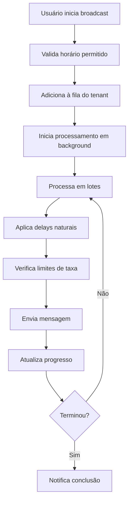

# Sistema de Controle de Envio WhatsApp

## 🎯 Objetivo

Implementar um sistema inteligente de envio de mensagens WhatsApp que simula o comportamento humano, evitando sobrecarga e bloqueios da API.

## 🧠 Características Principais

### 🔄 Envio Natural

- **Delays entre mensagens**: 2-3 segundos (como humano digitando)
- **Delays entre lotes**: 10-15 segundos (pausas naturais)
- **Processamento em lotes**: 3-5 mensagens por vez

### 🛡️ Controle de Taxa

- **Limite por minuto**: 20-30 mensagens
- **Limite por hora**: 80-100 mensagens
- **Retry automático**: 2-3 tentativas com delays

### ⏰ Horários Inteligentes

- **Janela de envio**: 9h às 21h (configurável)
- **Timezone por tenant**: Suporte a diferentes fusos
- **Bloqueio fora do horário**: Evita envios inadequados

## 📁 Arquitetura

### Componentes Principais

| Arquivo                                          | Função                                |
| ------------------------------------------------ | ------------------------------------- |
| `lib/server/flows/whatsapp/broadcastQueue.ts`    | Sistema de filas com controle de taxa |
| `lib/server/flows/whatsapp/broadcastManager.ts`  | Gerenciador multi-tenant              |
| `app/api/chats/message/broadcast/route.ts`       | API com progresso em tempo real       |
| `app/admin/whatsapp/mensagem-broadcast/page.tsx` | Interface com monitoramento           |

### Fluxo de Execução



## ⚙️ Configurações por Tenant

### Configuração Padrão (Conservadora)

```typescript
{
  // Delays (em ms)
  delayBetweenMessages: 3000,    // 3 segundos
  delayBetweenBatches: 15000,    // 15 segundos
  batchSize: 3,                   // 3 mensagens por lote

  // Limites de taxa
  maxMessagesPerMinute: 20,
  maxMessagesPerHour: 80,

  // Retry
  maxRetries: 2,
  retryDelay: 10000,             // 10 segundos

  // Horário
  allowedHours: { start: 9, end: 21 },
  timezone: 'America/Sao_Paulo'
}
```

### Configuração Agressiva (Para casos especiais)

```typescript
{
  delayBetweenMessages: 1500,    // 1.5 segundos
  delayBetweenBatches: 8000,     // 8 segundos
  batchSize: 5,                   // 5 mensagens por lote

  maxMessagesPerMinute: 30,
  maxMessagesPerHour: 100,

  maxRetries: 3,
  retryDelay: 5000,

  allowedHours: { start: 8, end: 22 },
  timezone: 'America/Sao_Paulo'
}
```

## 🔧 API Endpoints

### POST /api/chats/message/broadcast

Inicia um novo broadcast.

**Request:**

```json
{
  "message": "Olá! Esta é uma mensagem de teste.",
  "recipients": ["user1", "user2", "user3"]
}
```

**Response:**

```json
{
  "success": true,
  "message": "3 mensagens adicionadas à fila",
  "queueId": "tenant123",
  "totalMessages": 3,
  "estimatedTime": 2
}
```

### GET /api/chats/message/broadcast

Obtém progresso do broadcast atual.

**Response:**

```json
{
  "message": "Progresso do broadcast",
  "progress": {
    "total": 10,
    "sent": 7,
    "failed": 1,
    "pending": 2,
    "currentBatch": 3,
    "totalBatches": 4,
    "estimatedTimeRemaining": 180,
    "isProcessing": true
  }
}
```

### DELETE /api/chats/message/broadcast

Para o broadcast em andamento.

**Response:**

```json
{
  "message": "Broadcast parado com sucesso"
}
```

### GET /api/chats/whatsapp/config

Retorna a configuração atual do tenant. Caso não exista, um registro padrão é criado utilizando `whatsapp_broadcast_config`.

**Request:**

```http
GET /api/chats/whatsapp/config HTTP/1.1
X-Tenant-Id: tenant123
```

**Response:**

```json
{
  "delayBetweenMessages": 3000,
  "delayBetweenBatches": 15000,
  "batchSize": 3,
  "maxMessagesPerMinute": 20,
  "maxMessagesPerHour": 80,
  "maxRetries": 2,
  "retryDelay": 10000,
  "allowedHoursStart": 9,
  "allowedHoursEnd": 21,
  "timezone": "America/Sao_Paulo"
}
```

### POST /api/chats/whatsapp/config

Atualiza a configuração do broadcast para o tenant informado.

**Request:**

```json
{
  "delayBetweenMessages": 2000,
  "allowedHours": { "start": 8, "end": 22 }
}
```

**Response:**

```json
{
  "delayBetweenMessages": 2000,
  "delayBetweenBatches": 15000,
  "batchSize": 3,
  "maxMessagesPerMinute": 20,
  "maxMessagesPerHour": 80,
  "maxRetries": 2,
  "retryDelay": 10000,
  "allowedHoursStart": 8,
  "allowedHoursEnd": 22,
  "timezone": "America/Sao_Paulo"
}
```

## 📊 Monitoramento em Tempo Real

### Interface do Usuário

A página de broadcast agora inclui:

- **Barra de progresso** visual
- **Contadores** em tempo real (enviados/falharam/pendentes)
- **Tempo estimado** restante
- **Botão de parar** broadcast
- **Status** de processamento

### Polling Automático

- **Atualização**: A cada 2 segundos
- **Parada automática**: Quando broadcast termina
- **Limpeza**: Remove intervalos ao sair da página

## 🗄️ Configuração no Banco de Dados

### Coleção: `whatsapp_broadcast_config`

```sql
CREATE TABLE whatsapp_broadcast_config (
  id TEXT PRIMARY KEY,
  cliente TEXT REFERENCES m24_clientes(id),

  -- Delays
  delayBetweenMessages INTEGER DEFAULT 3000,
  delayBetweenBatches INTEGER DEFAULT 15000,
  batchSize INTEGER DEFAULT 3,

  -- Limites
  maxMessagesPerMinute INTEGER DEFAULT 20,
  maxMessagesPerHour INTEGER DEFAULT 80,

  -- Retry
  maxRetries INTEGER DEFAULT 2,
  retryDelay INTEGER DEFAULT 10000,

  -- Horário
  allowedHoursStart INTEGER DEFAULT 9,
  allowedHoursEnd INTEGER DEFAULT 21,
  timezone TEXT DEFAULT 'America/Sao_Paulo',

  created TIMESTAMP DEFAULT NOW(),
  updated TIMESTAMP DEFAULT NOW()
);
```

O endpoint `/api/chats/whatsapp/config` é responsável por ler e persistir esses dados. Na primeira chamada, caso não exista registro para o tenant, um documento é criado com os valores padrão. Quando um POST (ou PUT) atualiza a configuração, a instância em memória é sincronizada via `broadcastManager.updateTenantConfig`, garantindo que novos envios respeitem as regras definidas em `whatsapp_broadcast_config`.

## 🧪 Testes

### Executar Testes

```bash
npm test
```

### Cenários Testados

- ✅ Adição de mensagens à fila
- ✅ Processamento com sucesso
- ✅ Retry automático em falhas
- ✅ Limites de taxa
- ✅ Parada de processamento
- ✅ Limpeza de fila
- ✅ Cálculo de tempo estimado

## 🚀 Benefícios

### 🔒 Segurança

- **Evita bloqueios** da API WhatsApp
- **Respeita limites** de taxa
- **Horários apropriados** para envio

### 🎯 Eficiência

- **Processamento em background** (não bloqueia UI)
- **Retry inteligente** para falhas temporárias
- **Progresso em tempo real**

### 🧩 Flexibilidade

- **Configuração por tenant**
- **Diferentes perfis** (conservador/agressivo)
- **Fácil extensão** para novos recursos

### 📈 Monitoramento

- **Estatísticas detalhadas**
- **Logs de erro**
- **Métricas de performance**

## 🔮 Próximas Melhorias

### Funcionalidades Planejadas

1. **Agendamento de Broadcasts**
   - Envio programado para horários específicos
   - Suporte a timezone do destinatário

2. **Templates de Mensagem**
   - Variáveis dinâmicas (nome, empresa, etc.)
   - Preview antes do envio

3. **Relatórios Avançados**
   - Taxa de entrega
   - Horários de melhor resposta
   - Análise de engajamento

4. **Integração com Filas**
   - Redis para persistência
   - Processamento distribuído
   - Failover automático

5. **Machine Learning**
   - Otimização automática de horários
   - Detecção de padrões de resposta
   - Ajuste dinâmico de delays

## 🐛 Troubleshooting

### Problemas Comuns

**Broadcast não inicia:**

- Verificar horário permitido
- Verificar se já há broadcast ativo
- Verificar configuração WhatsApp

**Mensagens não são enviadas:**

- Verificar limites de taxa
- Verificar conectividade com Evolution API
- Verificar credenciais da instância

**Progresso não atualiza:**

- Verificar polling no frontend
- Verificar logs do servidor
- Verificar status da fila

### Logs Importantes

```typescript
// Logs de erro
console.error('Erro no processamento da fila:', error)

// Logs de progresso
console.log(`Broadcast: ${sent}/${total} mensagens enviadas`)

// Logs de taxa
console.log(`Taxa atual: ${messagesLastMinute}/min, ${messagesLastHour}/h`)
```

## 📝 Exemplo de Uso

### Frontend

```typescript
// Iniciar broadcast
const response = await fetch('/api/chats/message/broadcast', {
  method: 'POST',
  headers: { 'Content-Type': 'application/json' },
  body: JSON.stringify({
    message: 'Olá! Lembrete importante.',
    recipients: ['user1', 'user2'],
  }),
})

const data = await response.json()
console.log(`Broadcast iniciado: ${data.message}`)

// Monitorar progresso
const checkProgress = async () => {
  const res = await fetch('/api/chats/message/broadcast')
  const progress = await res.json()

  if (progress.progress) {
    console.log(
      `Progresso: ${progress.progress.sent}/${progress.progress.total}`,
    )

    if (!progress.progress.isProcessing) {
      console.log('Broadcast concluído!')
    }
  }
}

// Verificar a cada 2 segundos
setInterval(checkProgress, 2000)
```

### Backend

```typescript
// Configurar tenant específico
broadcastManager.updateTenantConfig('tenant123', {
  delayBetweenMessages: 2000,
  maxMessagesPerMinute: 25,
  allowedHours: { start: 8, end: 22 },
})

// Obter estatísticas
const stats = broadcastManager.getAllStats()
console.log('Estatísticas:', stats)
```

Este sistema garante que o envio de mensagens WhatsApp seja feito de forma natural, segura e eficiente, evitando problemas com a API e proporcionando uma experiência profissional para os usuários.
