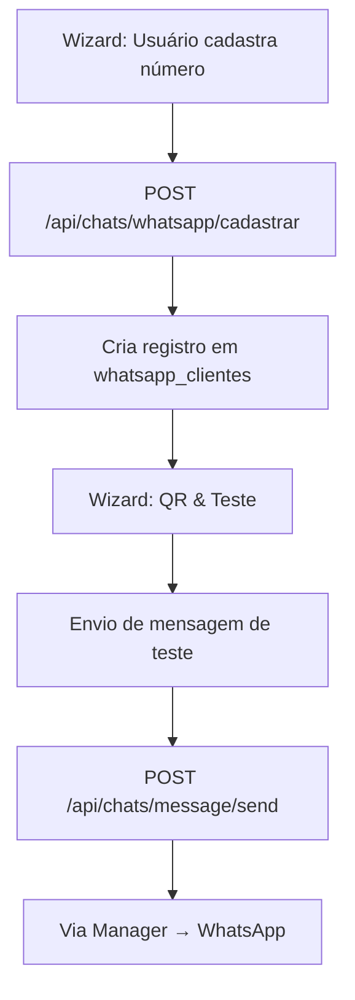

# Guia Simplificado de Integração com Evolution Chats API v2.2.2

Este guia descreve passo a passo como integrar a Evolution Chats API (v2.2.2) em um projeto Next.js + PocketBase, incluindo requisitos, modelagem de dados, endpoints e fluxo de onboarding.

---

## 1. Requisitos Funcionais

1. **Cadastro de Telefone**
   Usuário insere número de WhatsApp em formato E.164.
2. **Persistência de Instância**
   Armazenar `cliente`, `instanceName` e `apiKey` na coleção `whatsapp_clientes`.
3. **Geração de QR Code**
   Atualização automática via evento `qrCode` do webhook.
4. **Gerenciamento de Sessão**
   Atualizar `sessionStatus` conforme eventos (`ready`, `disconnected`).
5. **Envio de Mensagens**
   Endpoints para envio de texto e mídia (`sendText`, opcional `sendMedia`/`sendPtv`).
6. **Onboarding Guiado**
   Wizard em 4 passos para coordenadores, sem expor configuração manual de instância.
7. **Segurança**
   Validação de `x-tenant-id`, autenticação PocketBase, HMAC nos webhooks (opcional).
8. **Testabilidade**
   Endpoints de teste para simular webhook e envio de mensagem.

9. **Docs** 
    Consta em (docs/Evolution/) documentos auxiliares
---

## 2. Modelagem da Coleção `whatsapp_clientes`

Armazena as instâncias de WhatsApp por cliente.

| Campo           | Tipo     | Obrigatório | Validação                            | Descrição                                           |
| --------------- | -------- | ----------- | ------------------------------------ | --------------------------------------------------- |
| `cliente`       | Relation | Sim         | Referência a `m24_cliente`           | Cliente/tenant do sistema                           |
| `instanceName`  | Text     | Sim         | `^[a-z0-9-]+$`                       | Nome da instância (igual ao configurado no Manager) |
| `apiKey`        | Text     | Sim         | Mínimo 32 caracteres                 | Chave de autenticação da instância                  |
| `qrCode`        | Text     | Não         | URL ou Base64                        | QR Code gerado para autenticação                    |
| `sessionStatus` | Select   | Sim         | `pending`/`connected`/`disconnected` | Estado atual da sessão (padrão: `pending`)          |

### 2.1 Exemplo de Registro

```json
{
  "id": "abc123",
  "cliente": "m24_cliente/xyz789",
  "instanceName": "bayleys",
  "apiKey": "XXXXXXXXXXXXXXXXXXXXXXXXXXXXXXXX",
  "qrCode": "data:image/png;base64,iVBORw0K...",
  "sessionStatus": "connected"
}
```

---

## 3. Endpoints da API Interna

A aplicação Next.js expõe rotas que consomem a Evolution Chats API:

| Método | Caminho              | Descrição                                                           | Body de Exemplo    |
| ------ | -------------------- | ------------------------------------------------------------------- | ------------------ |
| POST   | `/api/chats/webhook` | Recebe eventos da Evolution (qrCode, ready, disconnected, messages) | **HTTP POST**<br/> |

````json
{
  "eventName": "qrCode",
  "body": { "instanceName": "bayleys", "qrCode": "data:image/png;base64,..." }
}
```  |
| POST   | `/api/chats/whatsapp/cadastrar`      | Cria registro em `whatsapp_clientes` com instância `WHATSAPP-BAILEYS` | **HTTP POST**<br/>
```json
{ "telefone": "5511999999999", "instanceName": "WHATSAPP-BAILEYS" }
```  |
| POST   | `/api/chats/message/sendText`            | Envia mensagem de texto pelo WhatsApp                                | **HTTP POST**<br/>
```json
{ "to": "5511999999999", "message": "Mensagem de teste" }
```  |

> *Observação: os eventos de sessão e geração de QR Code são tratados automaticamente pelo webhook.*

---

## 4. Onboarding Wizard do Coordenador

Fluxo em 4 etapas:
1. **Cadastro de Telefone** (`/whatsapp/cadastrar`)
2. **Configuração Automática**
   - Exibe spinner “Configurando sua instância...” por 2 segundos.
3. **Exibição de QR Code**
   - QR exibido no painel, atualizado pelo webhook.
4. **Envio de Mensagem de Teste** (`/api/chats/message/sendText`)

```tsx
'use client';
import { useState, useEffect } from 'react';
import { Step1, Step3, Step4 } from './steps';

type Step = 1|2|3|4;
export default function OnboardingWizard() {
  const [step, setStep] = useState<Step>(1);
  const next = () => setStep(s => (s < 4 ? (s + 1) as Step : s));
  useEffect(() => { if (step === 2) setTimeout(next, 2000); }, [step]);
  return (
    <div className="wizard-container">
      {step === 1 && <Step1 onNext={next} />}
      {step === 2 && (
        <div className="flex flex-col items-center p-8">
          <span>Configurando sua instância...</span>
          <div className="animate-spin h-12 w-12 border-4 border-t-green-600 rounded-full" />
        </div>
      )}
      {step === 3 && <Step3 onNext={next} />}
      {step === 4 && <Step4 />}
    </div>
  );
}
````

---

## 5. Fluxograma de Integração



---

## 6. Configuração no Manager

1. Acesse: `https://apievolution-evolution.r8dlf0.easypanel.host/manager/`
2. **API Keys**: copie a `apiKey` da instância.
3. **Webhooks**: callback para `/api/chats/webhook`, eventos `qrCode`, `authenticated`, `disconnected`, `messages.upsert`.
4. **InstanceName**: defina no PocketBase exatamente como está no Manager.

---

## 7. Consumo no Next.js + PocketBase

- **Variáveis de Ambiente**:

  ```env
  EVOLUTION_API_URL=https://apievolution-evolution.r8dlf0.easypanel.host
  PB_URL=https://<seu-pb-domain>
  ```

- **Serviço** (`lib/server/chats.ts`): funções `getClient`, `saveClient`, `generateQr`, `sendMessage`.
- **Rotas**: `/api/chats/webhook`, `/api/chats/whatsapp/cadastrar`, `/api/chats/message/sendText`.

---

## 8. Testes e Considerações Finais

- Valide o webhook enviando eventos de `qrCode` e `ready` no Manager.
- Teste o envio de mensagens pelo painel e por fluxo automático.
- Monitore logs de erros e reinicie instâncias pelo Manager em caso de falhas.


