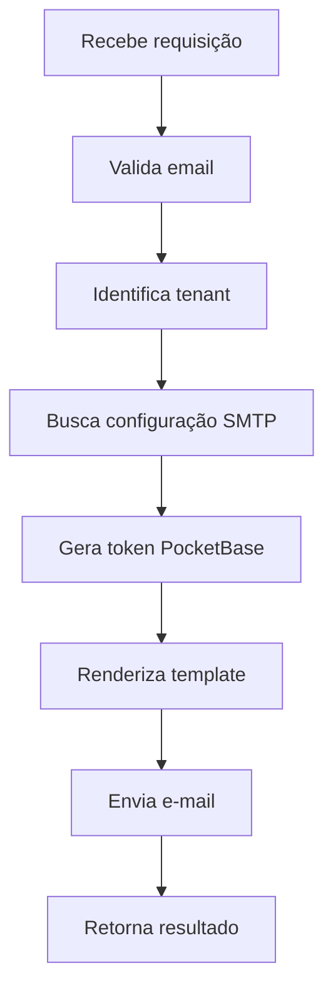

# Recuperação de Senha Multi-Tenant (Manual via SMTP)

## 🎯 Objetivo

Permitir que cada tenant envie e-mails de recuperação de senha com:
- **Branding e SMTP próprios** (armazenados em `m24_clientes`)
- **Template personalizado** (`lib/templates/resetPassword.html`)
- **Token de redefinição** gerado via PocketBase
- **Sem concorrência** ou mutações globais em `pb.settings`

## 🧠 Visão Geral do Fluxo

1. **Identificar o tenant** via `getTenantFromHost()`
2. **Gerar o token** de recuperação com `pb.collection("usuarios").requestPasswordReset(email)`
3. **Buscar o token** gerado no campo `verificationToken` do usuário
4. **Renderizar o template** HTML, substituindo placeholders
5. **Enviar o e-mail** manualmente com nodemailer usando o SMTP do tenant

## 📁 Estrutura de Arquivos

| Arquivo | Descrição |
|---------|-----------|
| `lib/templates/resetPassword.html` | Template HTML com placeholders |
| `lib/server/email/renderTemplate.ts` | Função que substitui placeholders |
| `lib/server/flows/usuarios/requestPasswordResetManual.ts` | Função principal que executa o fluxo completo |
| `app/api/usuarios/password-reset/route.ts` | Rota da API para solicitar recuperação |

## 📄 Template HTML

O template `lib/templates/resetPassword.html` inclui:

- **Design responsivo** e moderno
- **Placeholders dinâmicos**: `{{token}}`, `{{app_name}}`, `{{logo_url}}`, etc.
- **Cores personalizáveis** via `{{accent_color}}` e `{{accent_color_dark}}`
- **Link de recuperação** funcional
- **Avisos de segurança** e instruções claras

### Placeholders Disponíveis

| Placeholder | Descrição | Fonte |
|-------------|-----------|-------|
| `{{token}}` | Token de verificação | PocketBase |
| `{{app_name}}` | Nome da aplicação | `m24_clientes.nome` |
| `{{logo_url}}` | URL do logo | `m24_clientes.logo_url` |
| `{{accent_color}}` | Cor primária | `m24_clientes.cor_primary` |
| `{{accent_color_dark}}` | Cor primária escura | Calculada automaticamente |
| `{{url}}` | URL base da aplicação | Headers da requisição |
| `{{dominio}}` | Domínio do tenant | `m24_clientes.dominio` |

## 📤 Exemplo de Uso

### No Backend (API Route)

```typescript
import { requestPasswordResetManual } from "@/lib/server/flows/usuarios/requestPasswordResetManual"

// Na rota da API
const result = await requestPasswordResetManual("email@exemplo.com")

if (result.success) {
  return NextResponse.json({ message: result.message })
} else {
  return NextResponse.json({ error: result.message }, { status: 400 })
}
```

### No Frontend

```typescript
const response = await fetch('/api/usuarios/password-reset', {
  method: 'POST',
  headers: { 'Content-Type': 'application/json' },
  body: JSON.stringify({ email: 'usuario@exemplo.com' })
})

const data = await response.json()

if (response.ok) {
  // Sucesso - mostrar mensagem
  console.log(data.message)
} else {
  // Erro - mostrar erro
  console.error(data.error)
}
```

## 🔐 Campos Exigidos na Coleção `m24_clientes`

Certifique-se de que os seguintes campos estejam preenchidos para o tenant:

| Campo | Tipo | Descrição |
|-------|------|-----------|
| `smtp_host` | string | Servidor SMTP (ex: smtp.gmail.com) |
| `smtp_port` | number | Porta SMTP (ex: 587, 465) |
| `smtp_user` | string | Usuário SMTP |
| `smtp_pass` | string | Senha SMTP |
| `smtp_from` | string | E-mail remetente |
| `logo_url` | string | URL do logo da empresa |
| `cor_primary` | string | Cor primária em hex (#RRGGBB) |
| `nome` | string | Nome da empresa/aplicação |
| `dominio` | string | Domínio do tenant |

## ✅ Benefícios

### 🔒 Isolamento Completo
- Cada tenant usa seu próprio SMTP
- Templates personalizados por tenant
- Sem interferência entre tenants

### 🧩 Arquitetura Alinhada
- Totalmente integrado ao design system
- Usa funções existentes (`getTenantFromHost`)
- Segue padrões do projeto

### 🛡️ Segurança
- Sem mutações em `pb.settings`
- Evita problemas de concorrência
- Tokens gerados pelo PocketBase

### 📦 Extensibilidade
- Fácil adicionar filas de e-mail
- Suporte a logs e analytics
- Template system reutilizável

## 🚀 Fluxo de Execução



## 🔧 Configuração de Teste

### 1. Configurar Tenant
```sql
UPDATE m24_clientes SET 
  smtp_host = 'smtp.gmail.com',
  smtp_port = 587,
  smtp_user = 'seu-email@gmail.com',
  smtp_pass = 'sua-senha-app',
  smtp_from = 'noreply@seudominio.com',
  logo_url = 'https://seudominio.com/logo.png',
  cor_primary = '#007bff',
  nome = 'Minha Empresa',
  dominio = 'seudominio.com'
WHERE id = 'tenant-id';
```

### 2. Testar API
```bash
curl -X POST http://localhost:3000/api/usuarios/password-reset \
  -H "Content-Type: application/json" \
  -d '{"email": "teste@exemplo.com"}'
```

## 🐛 Troubleshooting

### Erro: "Tenant não identificado"
- Verificar se o domínio está configurado em `clientes_config`
- Verificar se o cookie `tenantId` está sendo definido

### Erro: "Campo obrigatório não configurado"
- Verificar se todos os campos SMTP estão preenchidos em `m24_clientes`
- Verificar se `cor_primary` está em formato hex válido

### Erro: "Usuário não encontrado"
- Verificar se o e-mail existe na coleção `usuarios`
- Verificar se o usuário pertence ao tenant correto

### Erro SMTP
- Verificar credenciais SMTP
- Verificar se a porta está correta
- Verificar se o servidor permite autenticação

## 📝 Logs e Monitoramento

A função registra logs detalhados para facilitar o debugging:

```typescript
console.error('Erro na recuperação de senha:', error)
```

Recomenda-se implementar um sistema de logs mais robusto para produção. 