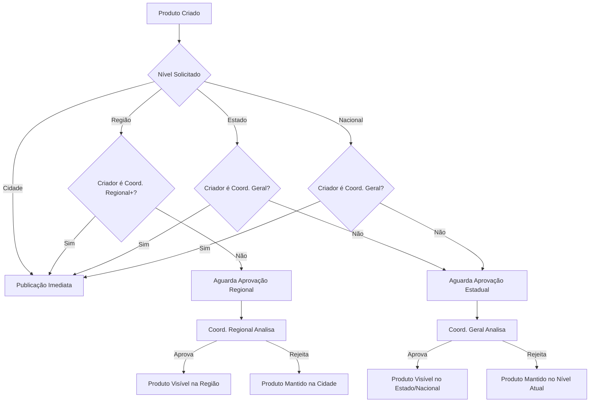

# 🔍 Sistema de Visibilidade Hierárquica de Produtos

## 📋 Visão Geral

O sistema de visibilidade hierárquica controla **onde e para quem** os produtos são exibidos com base na hierarquia territorial e no sistema de aprovações. Implementa as regras de negócio definidas:

- **Coordenador Geral**: Produtos visíveis nacionalmente (automático)
- **Coordenador Regional**: Produtos visíveis em toda a região (automático) ou precisa aprovação para nível estadual
- **Líder Local**: Produtos visíveis na cidade (automático) ou precisa aprovação para níveis superiores

## 🎯 Regras de Visibilidade

### **Níveis de Visibilidade**
```typescript
type NivelVisibilidade = 
  | 'cidade'        // Apenas na cidade do líder
  | 'regiao'        // Toda a região
  | 'estado'        // Todo o estado  
  | 'nacional'      // Todo o país
```

### **Matriz de Aprovações**

| Nível do Usuário | Pode Publicar Direto | Precisa Aprovação |
|------------------|---------------------|-------------------|
| **Líder Local** | `cidade` | `regiao` (Coord. Regional)<br/>`estado` (Coord. Geral)<br/>`nacional` (Coord. Geral) |
| **Coord. Regional** | `cidade`, `regiao` | `estado` (Coord. Geral)<br/>`nacional` (Coord. Geral) |
| **Coord. Geral** | `cidade`, `regiao`, `estado`, `nacional` | *(nenhum)* |

### **Fluxo de Aprovação**



## 🏗️ Arquitetura Técnica

### **Componentes Principais**

#### 1. **ProdutoVisibilidade**
Controla a visibilidade de cada produto:
```typescript
type ProdutoVisibilidade = {
  produto_id: string
  criado_por: string
  nivel_criador: NivelHierarquia
  nivel_visibilidade_atual: NivelVisibilidade
  nivel_visibilidade_solicitado: NivelVisibilidade
  status_autorizacao: StatusAutorizacao
  territorios_visiveis: {
    estados: string[]
    regioes: string[]  
    cidades: string[]
  }
  // ... outros campos
}
```

#### 2. **SolicitacaoAprovacao**
Gerencia pedidos de ampliação de visibilidade:
```typescript
type SolicitacaoAprovacao = {
  produto_id: string
  solicitante_id: string
  nivel_atual: NivelVisibilidade
  nivel_solicitado: NivelVisibilidade
  justificativa: string
  aprovador_necessario: NivelHierarquia
  status: StatusAutorizacao
  produto_info: {
    performance_atual: PerformanceProduto
  }
}
```

#### 3. **Engine de Visibilidade**
Filtros automáticos que determinam quais produtos cada usuário vê:
```typescript
// Exemplo de filtro para usuário em São Paulo/Zona Sul
const filtroVisibilidade = `
  (territorios_visiveis.cidades ~ "sp-zona-sul") ||
  (territorios_visiveis.regioes ~ "sao-paulo-capital") ||
  (territorios_visiveis.estados ~ "sao-paulo") ||
  (territorios_visiveis.estados ~ "*")
`
```

## 🚀 Funcionalidades Implementadas

### **1. Criação de Produto com Visibilidade**
```typescript
// Líder Local criando produto
await criarProdutoComVisibilidade(
  produtoId: "prod_123",
  criadoPor: "lider_zona_sul",
  nivelCriador: "lider_local",
  nivelVisibilidadeSolicitado: "regiao", // Precisa aprovação
  territorioUsuario: {
    estado_id: "sao-paulo",
    regiao_id: "capital", 
    cidade_id: "zona-sul"
  }
)
// Resultado: Produto fica visível apenas na cidade até aprovação
```

### **2. Solicitação de Ampliação**
```typescript
await solicitarAlteracaoVisibilidade(
  produtoVisibilidadeId: "vis_123",
  novoNivelVisibilidade: "estado",
  solicitanteId: "coord_regional_sp",
  justificativa: "Produto tem alta demanda em todo o estado"
)
// Cria solicitação para Coordenador Geral aprovar
```

### **3. Processamento de Aprovação**
```typescript
await processarAprovacao(
  solicitacaoId: "sol_456",
  aprovadorId: "coord_geral_sp", 
  acao: "aprovar",
  comentarios: "Produto tem potencial. Aprovado para todo o estado."
)
// Atualiza visibilidade e envia notificações
```

### **4. Consulta de Produtos Visíveis**
```typescript
const produtos = await buscarProdutosVisiveis(
  usuarioId: "cliente_abc",
  territorioUsuario: {
    estado_id: "sao-paulo",
    regiao_id: "capital",
    cidade_id: "zona-oeste"
  }
)
// Retorna apenas produtos visíveis para este território
```

## 📊 Dashboard de Aprovações

### **Métricas Principais**
- **Pendentes de Aprovação**: Solicitações aguardando análise
- **Taxa de Aprovação**: % de solicitações aprovadas vs. rejeitadas  
- **Tempo Médio**: Tempo entre solicitação e decisão
- **Produtos em Destaque**: Mais solicitados para ampliação

### **Funcionalidades do Dashboard**
- ✅ **Análise Detalhada**: Performance, justificativa, histórico
- ✅ **Aprovação Rápida**: Botões de ação direta
- ✅ **Filtros Avançados**: Por nível, status, período
- ✅ **Notificações**: Alertas para solicitações urgentes
- ✅ **Histórico**: Auditoria completa de decisões

## 🔍 Casos de Uso Práticos

### **Caso 1: Produto Local com Potencial**
```
1. Líder de Campinas cria "Curso de Excel Avançado"
2. Produto fica visível apenas em Campinas
3. Vendas crescem 200% no primeiro mês
4. Líder solicita visibilidade regional: "Alta demanda em cidades vizinhas"
5. Coordenador Regional aprova para toda região de Campinas
6. Produto agora visível em Americana, Sumaré, Valinhos, etc.
```

### **Caso 2: Produto Inovador Estadual**
```  
1. Coordenador Regional do Rio cria "Sistema de Energia Solar"
2. Produto fica visível em toda região metropolitana
3. Performance excepcional com avaliação 4.9
4. Coordenador solicita nível estadual: "Produto inovador sem concorrência"
5. Coordenador Geral analisa e aprova para todo estado do RJ
6. Produto visível em Campos, Petrópolis, Angra dos Reis, etc.
```

### **Caso 3: Produto Nacional**
```
1. Coordenador Geral cria "Plataforma de Gestão M24"
2. Sistema detecta nível automático: nacional
3. Produto imediatamente visível em todo o Brasil
4. Sem necessidade de aprovação adicional
```

## ⚙️ Configurações e Regras

### **Limites por Nível**
```typescript
const LIMITES_USUARIO = {
  lider_local: 10,        // Máx 10 produtos pendentes
  coordenador_regional: 25, // Máx 25 produtos pendentes  
  coordenador_geral: 100    // Máx 100 produtos pendentes
}
```

### **Tempo Máximo para Aprovação**
```typescript
const TEMPO_MAXIMO_APROVACAO = {
  cidade: 0,      // Imediato
  regiao: 24,     // 24 horas
  estado: 48,     // 48 horas
  nacional: 72    // 72 horas
}
```

### **Critérios de Auto-Aprovação** *(Futuro)*
```typescript
const CRITERIOS_AUTO_APROVACAO = {
  nota_minima_produto: 4.5,
  vendas_minimas_mes: 50,
  avaliacao_vendedor_minima: 4.0,
  sem_denuncias_dias: 30
}
```

## 📈 Analytics e Relatórios

### **Métricas de Visibilidade**
- **Alcance por Produto**: Quantos territórios cada produto atinge
- **Performance por Nível**: Vendas por nível de visibilidade
- **Taxa de Conversão**: Efetividade da ampliação de visibilidade
- **Produtos Trending**: Mais solicitados para ampliação

### **Relatórios Disponíveis**
- 📊 **Relatório de Produtos por Visibilidade**
- 📈 **Performance de Aprovações por Coordenador**
- 🎯 **Produtos com Maior Potencial de Expansão**
- ⏱️ **Tempo de Resposta de Aprovações**

## 🔐 Segurança e Auditoria

### **Controles de Acesso**
- ✅ **Verificação de Permissões**: Usuário pode gerenciar/aprovar?
- ✅ **Validação de Território**: Dentro da jurisdição?
- ✅ **Limite de Solicitações**: Respeita limites por nível?
- ✅ **Histórico Completo**: Todas as alterações registradas

### **Auditoria**
```typescript
type AprovacaoHistorico = {
  tipo: 'criacao' | 'solicitacao_aprovacao' | 'aprovacao' | 'rejeicao'
  nivel_anterior?: NivelVisibilidade
  nivel_solicitado: NivelVisibilidade
  solicitante_id: string
  aprovador_id?: string
  comentarios?: string
  data: string
}
```

## 🚀 APIs Principais

### **Criar Produto com Visibilidade**
```http
POST /api/produtos/visibilidade
{
  "produto_id": "prod_123",
  "nivel_visibilidade_solicitado": "regiao",
  "territorio_usuario": {
    "estado_id": "sp",
    "regiao_id": "capital", 
    "cidade_id": "zona-sul"
  }
}
```

### **Solicitar Alteração de Visibilidade**
```http
POST /api/produtos/visibilidade/{id}/solicitar-alteracao
{
  "novo_nivel_visibilidade": "estado",
  "justificativa": "Alta demanda em todo o estado"
}
```

### **Processar Aprovação**
```http
PUT /api/solicitacoes-aprovacao/{id}/processar
{
  "acao": "aprovar", // ou "rejeitar"
  "comentarios": "Produto tem potencial. Aprovado."
}
```

### **Buscar Produtos Visíveis**
```http
GET /api/produtos/visiveis?territorio=sp-capital-zona-oeste&categoria=eletronicos
```

## 🔄 Integrações

### **Sistema de Notificações**
- 📧 **Email**: Notificações de solicitações e decisões
- 🔔 **Push**: Alertas em tempo real no painel
- 📱 **SMS**: Notificações urgentes (opcional)

### **Sistema de Analytics**
- 📊 **Métricas de Produto**: Integração com analytics de vendas
- 📈 **Performance Tracking**: Acompanhamento pós-aprovação
- 🎯 **A/B Testing**: Testes de visibilidade regional

### **Sistema de Cache**
- ⚡ **Cache de Filtros**: Filtros de visibilidade em Redis
- 🔄 **Invalidação Automática**: Cache atualizado nas aprovações
- 📊 **Cache de Métricas**: Dashboard com dados em cache

## 📋 Checklist de Implementação

### **Fase 1: Core System** ✅
- [x] Tipos TypeScript para visibilidade
- [x] Serviços de controle de visibilidade  
- [x] Sistema de aprovações
- [x] Dashboard de aprovações

### **Fase 2: UX/UI** 
- [ ] Interface de solicitação para vendedores
- [ ] Notificações em tempo real
- [ ] Mobile-first design
- [ ] Integração com WhatsApp

### **Fase 3: Analytics**
- [ ] Relatórios de performance
- [ ] Métricas de conversão por território
- [ ] Análise de potencial de produtos
- [ ] Dashboard executivo

### **Fase 4: Otimizações**
- [ ] Auto-aprovação baseada em critérios
- [ ] Machine Learning para recomendações
- [ ] Cache avançado com edge computing
- [ ] Sistema de alertas inteligentes

## 🎯 Benefícios do Sistema

### **Para Líderes Locais**
- 🚀 **Expansão Controlada**: Amplie alcance com aprovação
- 📊 **Dados de Performance**: Justifique solicitações com métricas
- 🎯 **Foco Local**: Produtos relevantes para sua região
- 💡 **Oportunidades**: Identifique produtos com potencial

### **Para Coordenadores Regionais**
- ⚖️ **Controle de Qualidade**: Aprove apenas produtos adequados
- 📈 **Visão Regional**: Produtos com potencial em toda região
- 🔍 **Análise Detalhada**: Performance completa antes da decisão
- ⏱️ **Eficiência**: Dashboard otimizado para decisões rápidas

### **Para Coordenadores Gerais**
- 🌍 **Visão Estratégica**: Produtos com potencial nacional
- 📊 **Analytics Completos**: Métricas de toda a hierarquia
- 🎯 **Produtos Premium**: Apenas os melhores chegam ao nível estadual
- 🚀 **Escalabilidade**: Sistema preparado para crescimento

### **Para o Negócio**
- 💰 **Mais Vendas**: Produtos certos nos territórios certos
- 🎯 **Relevância**: Produtos locais para demandas locais
- 📈 **Growth**: Expansão orgânica baseada em performance
- 🛡️ **Qualidade**: Controle de qualidade distribuído

## 📞 Suporte e Recursos

### **Documentação Técnica**
- [API Reference](./api-product-visibility.md)
- [Database Schema](./schema-product-visibility.sql)
- [Deployment Guide](./deployment-visibility.md)
- [Troubleshooting](./troubleshooting-visibility.md)

### **Guias de Uso**
- [Guia do Líder Local](./guide-local-leader.md)
- [Guia do Coordenador Regional](./guide-regional-coordinator.md)
- [Guia do Coordenador Geral](./guide-general-coordinator.md)
- [FAQ Sistema de Visibilidade](./faq-visibility.md)