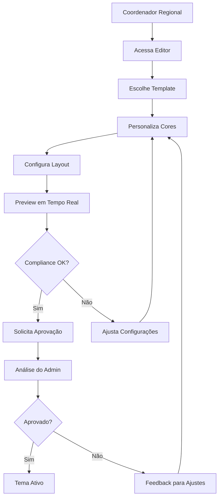
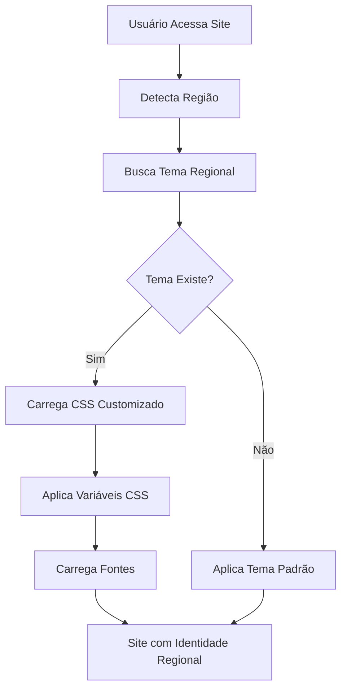

# 🎨 Sistema de Identidade Visual Regional

## Visão Geral

O sistema de identidade visual regional permite que cada região tenha sua própria identidade visual **mantendo um padrão de qualidade** corporativo. Cada região pode personalizar cores, logos, tipografia e layout dentro de diretrizes pré-aprovadas.

## ✨ Características Principais

### 🎯 **Customização Controlada**
- **Paleta de cores pré-aprovada** com opções que seguem diretrizes da marca
- **Templates profissionais** criados por designers
- **Sistema de aprovação** para garantir qualidade
- **Compliance automático** com verificações em tempo real

### 🚀 **Performance Otimizada**
- **Temas dinâmicos** carregados sob demanda
- **Cache inteligente** por região
- **Assets otimizados** (WebP, WOFF2, SVG)
- **CSS customizado** gerado automaticamente

### 🔧 **Editor Intuitivo**
- **Preview em tempo real** das alterações
- **Templates pré-definidos** para diferentes estilos
- **Verificação de compliance** automática
- **Histórico de versões** para rollback

## 🏗️ Arquitetura do Sistema

### Componentes Principais

```typescript
// Identidade Visual Regional
IdentidadeVisualRegional {
  cores: CoresPaleta          // Cores dentro da paleta aprovada
  logos: LogosRegionais       // Variações do logo regional
  tipografia: FontesAprovadas // Fontes pré-selecionadas
  layout: ConfiguracoesLayout // Estilos de UI/UX
  elementos: ElementosCustom  // Banners, ícones, etc.
}

// Sistema de Aprovação
AprovacaoDesign {
  alteracoes: Alteracao[]     // Lista de mudanças propostas
  compliance_check: Check     // Verificação automática
  status: StatusAprovacao     // Fluxo de aprovação
}

// Tema Dinâmico
TemaDinamico {
  css_customizado: string     // CSS gerado para a região
  css_variables: Variables    // Variáveis CSS aplicadas
  assets_otimizados: Assets   // Assets comprimidos e otimizados
}
```

## 🎨 Customização Disponível

### 1. **Cores**

#### Paleta Corporativa Aprovada
```css
/* Cores Primárias */
--azul-corporativo: #1E40AF;
--azul-claro: #3B82F6;
--azul-destaque: #60A5FA;

/* Cores Secundárias */
--verde-sucesso: #059669;
--verde-claro: #10B981;
--verde-destaque: #34D399;

/* Cores de Apoio */
--vermelho-alerta: #DC2626;
--laranja-aviso: #EA580C;
--roxo-premium: #7C3AED;
--cinza-neutro: #6B7280;
```

#### Aplicação de Cores
- **Cor Primária**: Botões principais, links, headers
- **Cor Secundária**: Botões secundários, ícones
- **Cor de Acento**: CTAs, destaques especiais
- **Cores de Texto**: Títulos e parágrafos
- **Cores de Fundo**: Backgrounds e cards

### 2. **Tipografia**

#### Fontes Aprovadas
```css
/* Fonte Principal - Títulos */
font-family: 'Inter', sans-serif;
font-family: 'Poppins', sans-serif;
font-family: 'Roboto', sans-serif;

/* Fonte Secundária - Corpo */
font-family: 'Inter', sans-serif;
font-family: 'Open Sans', sans-serif;
```

#### Hierarquia Tipográfica
- **H1**: 2.5rem (40px) - Títulos principais
- **H2**: 2rem (32px) - Títulos de seção
- **H3**: 1.5rem (24px) - Subtítulos
- **Body**: 1rem (16px) - Texto padrão
- **Small**: 0.875rem (14px) - Texto secundário

### 3. **Layout e Componentes**

#### Opções de Navbar
- **Minimal**: Padding reduzido, elementos essenciais
- **Completo**: Padding amplo, todos os elementos
- **Compacto**: Altura reduzida para mais conteúdo

#### Estilos de Botões
- **Rounded**: Bordas arredondadas (8px)
- **Square**: Bordas retas
- **Pill**: Bordas completamente arredondadas

#### Estilos de Cards
- **Shadow**: Sombra sutil para profundidade
- **Bordered**: Borda simples
- **Flat**: Sem sombra ou borda

## 🛠️ Como Usar

### 1. **Para Coordenadores Regionais**

#### Acessar o Editor
```bash
/admin/regioes/[id]/identidade-visual
```

#### Fluxo de Customização
1. **Escolher Template**: Selecione um template base
2. **Personalizar Cores**: Ajuste cores dentro da paleta aprovada
3. **Configurar Layout**: Defina estilos de componentes
4. **Preview**: Visualize as alterações em tempo real
5. **Solicitar Aprovação**: Envie para análise

#### Verificação de Compliance
O sistema verifica automaticamente:
- ✅ Cores estão na paleta aprovada
- ✅ Proporções de logo respeitadas
- ✅ Elementos obrigatórios presentes
- ✅ Contraste de acessibilidade adequado

### 2. **Para Desenvolvedores**

#### Integração com Hooks
```typescript
import { useAutoRegionalTheme } from '@/hooks/useRegionalTheme'

function MinhaApp() {
  const { tema, loading, regiaoId } = useAutoRegionalTheme()
  
  if (loading) return <Loading />
  
  return (
    <div className="app">
      {/* O tema é aplicado automaticamente */}
      <Header />
      <Content />
    </div>
  )
}
```

#### Usar Variáveis CSS
```css
.botao-customizado {
  background-color: var(--cor-primaria);
  color: var(--cor-texto-primario);
  border-radius: var(--border-radius-base);
  padding: var(--espacamento-base);
  font-family: var(--fonte-primaria);
}

.card-regional {
  background-color: var(--cor-fundo-secundario);
  border: 1px solid var(--cor-secundaria);
}
```

#### Preview de Temas
```typescript
import { useThemePreview } from '@/hooks/useRegionalTheme'

function EditorPreview() {
  const { iniciarPreview, finalizarPreview, isPreviewMode } = useThemePreview()
  
  const testarTema = () => {
    iniciarPreview(novoTema)
  }
  
  return (
    <div className={isPreviewMode ? 'preview-container' : ''}>
      {/* Conteúdo com preview */}
    </div>
  )
}
```

### 3. **Para Administradores**

#### Gestão de Aprovações
```bash
/admin/marketplace/identidade-visual/aprovacoes
```

#### Configurar Marca Corporativa
```typescript
const marcaCorporativa = {
  logo_corporativo: '/logo-empresa.svg',
  cores_corporativas: {
    primaria: '#1E40AF',
    secundaria: '#3B82F6'
  },
  diretrizes: {
    uso_logo_obrigatorio: true,
    tamanho_minimo_logo: 32,
    cores_proibidas: ['#FF0000', '#00FF00']
  }
}
```

## 🔄 Fluxos de Trabalho

### Fluxo de Customização


### Fluxo de Aplicação de Tema


## 📊 Analytics e Métricas

### Métricas de Performance
- **Tempo de permanência** por região
- **Taxa de conversão** com diferentes identidades
- **Satisfação do usuário** por design
- **Performance de carregamento** dos temas

### Comparativo Regional
```typescript
const analytics = {
  regiao: 'sao-paulo-capital',
  metricas: {
    tempo_permanencia_medio: 245, // segundos
    taxa_conversao: 0.08, // 8%
    satisfacao_usuario: 4.2, // 1-5 estrelas
    tempo_carregamento: 1.2 // segundos
  },
  ranking: {
    posicao: 3,
    total_regioes: 15,
    score_vs_media: 15 // 15% acima da média
  }
}
```

## 🔍 Testes A/B de Identidade

### Configurar Teste
```typescript
const testeAB = {
  regiao_id: 'sao-paulo-capital',
  identidade_teste: 'nova-identidade-sp',
  porcentagem_usuarios: 20, // 20% dos usuários
  duracao_dias: 14,
  metricas_acompanhar: [
    'taxa_conversao',
    'tempo_permanencia',
    'satisfacao_usuario'
  ]
}
```

### Análise de Resultados
- **Significância estatística** calculada automaticamente
- **Comparação de métricas** entre versões
- **Recomendações** baseadas em dados
- **Implementação automática** da versão vencedora

## 🚀 Otimizações de Performance

### Cache Inteligente
- **Cache por região** com TTL configurável
- **Invalidação automática** quando tema é atualizado
- **Pre-loading** de temas populares
- **Lazy loading** de assets não críticos

### Assets Otimizados
- **Imagens WebP** com fallback para JPEG/PNG
- **Fontes WOFF2** comprimidas
- **SVGs minificados** para ícones
- **CSS purgado** removendo regras não utilizadas

### CDN e Edge
- **Distribuição global** via Vercel Edge
- **Compression Gzip/Brotli** automática
- **HTTP/2 Push** para assets críticos
- **Service Worker** para cache offline

## 📋 Checklist de Implementação

### Fase 1: Estrutura Base
- [ ] Tipos TypeScript para identidade regional
- [ ] Serviços de gestão de temas
- [ ] Sistema de aprovação básico
- [ ] Editor visual inicial

### Fase 2: Funcionalidades Avançadas
- [ ] Templates pré-definidos
- [ ] Verificação de compliance
- [ ] Preview em tempo real
- [ ] Hooks de integração

### Fase 3: Performance e Scale
- [ ] Cache inteligente
- [ ] Otimização de assets
- [ ] Analytics de performance
- [ ] Testes A/B automatizados

### Fase 4: Governance e Qualidade
- [ ] Fluxo de aprovação robusto
- [ ] Auditoria de mudanças
- [ ] Backup e versionamento
- [ ] Documentação completa

## 🎯 Benefícios do Sistema

### Para as Regiões
- **Identidade própria** mantendo padrão corporativo
- **Facilidade de customização** sem conhecimento técnico
- **Flexibilidade** dentro de diretrizes seguras
- **Analytics** para medir performance do design

### Para a Empresa
- **Controle de qualidade** com aprovações
- **Consistency** da marca em todas as regiões
- **Escalabilidade** para novas regiões
- **Performance** otimizada automaticamente

### Para os Usuários
- **Experiência personalizada** por região
- **Carregamento rápido** com cache otimizado
- **Design responsivo** em todos os dispositivos
- **Acessibilidade** garantida por compliance

## 📞 Suporte e Recursos

### Documentação Técnica
- [API Reference](./api-reference.md)
- [Hooks Documentation](./hooks-guide.md)
- [Components Guide](./components-guide.md)
- [Troubleshooting](./troubleshooting.md)

### Recursos de Design
- [Brand Guidelines](./brand-guidelines.pdf)
- [Color Palette](./color-palette.sketch)
- [Template Library](./template-library.figma)
- [Icon Set](./icon-set.svg)

### Suporte
- **Chat**: Suporte técnico 24/7
- **Email**: design-system@empresa.com
- **Docs**: Documentação sempre atualizada
- **Community**: Fórum para dúvidas e sugestões